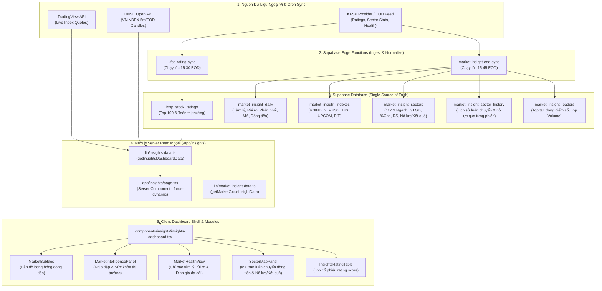

# Insights System Architecture, Data Semantics & Operations Handover

Tài liệu bàn giao và quy chuẩn vận hành chính thức cho toàn bộ trang **Insights thị trường** (`/insights`) trên hệ thống QeoIndex.

---

## 1. Sơ đồ Kiến trúc & Luồng Dữ liệu (System Architecture & Data Flow)



---

## 2. Chi tiết Ý nghĩa Nghiệp vụ & Dữ liệu (Data Dictionary & Financial Semantics)

### 2.1. Bản đồ Bong bóng Thị trường (Market Bubbles)
- **Vị trí**: Nằm ở đầu trang Insights.
- **Ý nghĩa tài chính**: Cung cấp cái nhìn trực quan toàn cảnh về sự phân bổ dòng tiền và hiệu suất giá của các cổ phiếu lớn/toàn thị trường theo các khung thời gian (`1D`, `1W`, `1M`, `1Y`).
- **Các trường dữ liệu**:
  - `ticker`: Mã cổ phiếu (VD: `HPG`, `SSI`, `VCB`).
  - `companyName`: Tên doanh nghiệp niêm yết.
  - `sector`: Nhóm ngành phân loại.
  - `volume`: Khối lượng giao dịch trong phiên (dùng để tính toán kích thước bán kính bong bóng theo logarit cơ số).
  - `change1d`, `change1w`, `change1m`, `change1y`: % Tăng/giảm giá theo khung thời gian.
- **Quy tắc phối màu động**:
  - 🟣 **Màu tím (Trần / Siêu tăng trưởng)**: `1D >= 7%`, `1W >= 15%`, `1M >= 30%`, `1Y >= 70%`.
  - 🟢 **Màu xanh lục (Tăng giá)**: `change > 0%`.
  - ⚪ **Màu xám (Đứng giá tham chiếu)**: `change == 0%`.
  - 🔴 **Màu đỏ (Giảm giá)**: `change < 0%`.
  - 🔵 **Màu xanh lơ / Cyan (Giảm sàn)**: `1D <= -7%`.

---

### 2.2. Nhịp đập & Sức khỏe Thị trường (Market Overview & Pulse)
- **Market Regime (Trạng thái thị trường)**:
  - Giá trị: `BÙNG NỔ`, `TĂNG GIÁ`, `PHÂN HÓA`, `TÍCH LŨY`, `ĐIỀU CHỈNH`, `RỦI RO CAO`.
  - *Ý nghĩa:* Đánh giá chu kỳ vĩ mô ngắn hạn dựa trên độ rộng, khối lượng và vị thế của các chỉ số chính.
- **Chỉ báo Tâm lý (Sentiment Gauge)**:
  - Thang điểm `0 - 100`:
    - `0 - 25`: Sợ hãi tột độ (Extreme Fear - Vùng quá bán, cơ hội tích lũy dài hạn).
    - `25 - 45`: Thận trọng / Sợ hãi (Fear).
    - `45 - 55`: Trung lập (Neutral).
    - `55 - 75`: Hưng phấn / Lạc quan (Greed).
    - `75 - 100`: Hưng phấn cực độ (Extreme Greed - Vùng cảnh báo điều chỉnh ngắn hạn).
- **Chỉ báo Rủi ro (Risk Indicator)**:
  - Thang điểm `0.00 - 1.00`: Đo lường xác suất phân phối và đảo chiều giảm điểm trong ngắn hạn dựa trên biến động giá của rổ dẫn dắt và áp lực cung tiềm ẩn.
- **Số ngày Phân phối (Distribution Count)**:
  - Số phiên phân phối (Volume tăng mạnh nhưng giá giảm hoặc đóng cửa gần đáy nến) trong khung cửa sổ 25 phiên gần nhất.
- **Độ rộng xu hướng (MA Breadth)**:
  - `% Trên MA10`: Tỷ lệ cổ phiếu đang giao dịch trên đường trung bình 10 ngày (Động lượng siêu ngắn).
  - `% Trên MA20`: Tỷ lệ cổ phiếu trên MA20 (Xu hướng ngắn hạn).
  - `% Trên MA50`: Tỷ lệ cổ phiếu trên MA50 (Xu hướng trung hạn).
  - `% Trên MA200`: Tỷ lệ cổ phiếu trên MA200 (Xu hướng dài hạn/Bull market).
- **Dòng tiền Tổ chức (Institutional Flows)**:
  - `Khối ngoại mua / bán / ròng (tỷ VND)`: Đo lường hoạt động của dòng vốn ngoại.
  - `Tự doanh mua / bán / ròng (tỷ VND)`: Hoạt động của các công ty chứng khoán.

---

### 2.3. Nhóm ngành Dẫn nhịp & Ma trận Luân chuyển Dòng tiền (Sector Rotation Matrix)
- **4 Trạng thái Luân chuyển Dòng tiền (RRG Quadrant Rotation)**:
  - 🟢 **Dẫn dắt (`leading`)**: Sức mạnh giá (RS) cao và Động lượng (Momentum) tăng $\to$ Nhóm ngành sinh lời vượt trội thị trường chung.
  - 🟡 **Cải thiện / Tích cực (`recovering` / `improving`)**: RS bắt đầu cải thiện từ vùng đáy, động lượng bứt phá $\to$ Tiền bắt đầu chảy vào tích lũy.
  - 🟠 **Suy yếu (`weakening`)**: RS vẫn ở mức cao nhưng động lượng giảm tốc $\to$ Xuất hiện áp lực chốt lời.
  - 🔴 **Tụt hậu (`lagging`)**: RS thấp và động lượng suy giảm $\to$ Nhóm ngành yếu hơn thị trường chung, dòng tiền rút ra.
- **Nỗ lực vs Kết quả (Wyckoff Effort & Result for Sectors)**:
  - **Nỗ lực (Effort %)**: Đo lường mức độ gia tăng thanh khoản/giá trị giao dịch của ngành so với mức bình quân các phiên trước.
  - **Kết quả (Result %)**: Biến động giá bình quân thực tế của các cổ phiếu trong ngành.
  - *Diễn giải Wyckoff:*
    - *Nỗ lực lớn + Kết quả lớn tăng*: Tích cực, dòng tiền lớn đẩy giá thành công.
    - *Nỗ lực lớn + Kết quả bé/âm*: Phân phối / Hấp thụ cung không hiệu quả (Cảnh báo đảo chiều).
    - *Nỗ lực nhỏ + Kết quả lớn tăng*: Tiết cung, giá tăng nhẹ nhàng.
- **Sparkline & Lịch sử 8 phiên**: Theo dõi chuỗi trạng thái luân chuyển và điểm sức mạnh tương đối (RS Score) của từng ngành qua từng phiên giao dịch.

---

### 2.4. Định giá Thị trường Đa dải (Valuation Multi-Band Chart)
- **Mục đích**: So sánh chỉ số P/E, P/B của toàn thị trường VN-Index với các dải độ lệch chuẩn lịch sử ($\pm 1\text{SD}, \pm 2\text{SD}$).
- **Ý nghĩa định giá**:
  - Dưới $-2\text{SD}$ (Vùng rẻ lịch sử / Đại suy thoái).
  - Giữa $-1\text{SD}$ và $-2\text{SD}$ (Vùng định giá hấp dẫn).
  - Quanh trục trung bình (Định giá hợp lý).
  - Vượt $+1\text{SD} \to +2\text{SD}$ (Vùng định giá đắt / Hưng phấn quá đà).

---

### 2.5. Bảng xếp hạng Top Cổ phiếu Rating Score (KFSP Model)
- **Composite Rating Score (0 - 100)**: Điểm xếp hạng tổng hợp dựa trên 4 trụ cột: Kỹ thuật (Technical), Động lượng (Momentum), Dòng tiền (Money Flow), Cơ bản (Fundamental).
- **CANSLIM Score**: Điểm tăng trưởng theo tiêu chí William O'Neil (Doanh thu, Lợi nhuận, Sản phẩm mới, Cung cầu, Dẫn đầu ngành, Bảo trợ tổ chức, Xu hướng thị trường).
- **4M Score**: Điểm đầu tư giá trị theo Phil Town (Meaning - Dễ hiểu, Moat - Lợi thế cạnh tranh, Management - Ban lãnh đạo, Margin of Safety - Biên an toàn).
- **RS Ngắn hạn (RSs) & RS Trung hạn (RSm)**: Sức mạnh giá tương đối so với VN-Index trong 3 tháng và 6 tháng.

---

## 3. Nguồn Dữ Liệu (Data Sources) & Database Schema

### 3.1. Các bảng cơ sở dữ liệu Supabase

| Bảng Cơ Sở Dữ Liệu | Vai trò & Dữ liệu lưu trữ | Cơ chế cập nhật |
| :--- | :--- | :--- |
| `public.market_insight_daily` | Lưu snapshot tổng hợp phiên: `sentiment_score`, `risk_score`, `distribution_count`, `above_ma10_pct` ... `above_ma200_pct`, `foreign_net_value`, `proprietary_net_value`, `total_traded_value`, `market_regime`. | Edge Function `market-insight-eod-sync` đẩy lúc 15:45 hàng ngày. |
| `public.market_insight_indexes` | Lưu chỉ số `VNINDEX`, `VN30`, `HNX`, `UPCOM`: `value`, `change_pct`, `advances`, `unchanged`, `declines`, `ceilings`, `floors`, `market_pe`. | Edge Function `market-insight-eod-sync`. |
| `public.market_insight_sectors` | Lưu dữ liệu 11-19 ngành cho phiên hiện tại: `traded_value`, `average_change_pct`, `advances`, `declines`, `rs_score`, `rotation_state`, `effort_pct`, `result_pct`. | Edge Function `market-insight-eod-sync`. |
| `public.market_insight_sector_history` | Lưu lịch sử chuyển động ngành theo từng phiên (`session_date`, `sector_key`, `rotation_state`, `rs_score`, `effort_pct`, `result_pct`). | Edge Function `market-insight-eod-sync`. |
| `public.market_insight_leaders` | Top cổ phiếu tác động điểm số, top thanh khoản, top biến động. | Edge Function `market-insight-eod-sync`. |
| `public.kfsp_stock_ratings` | Toàn bộ 1,752 cổ phiếu với đầy đủ điểm số: `kfsp_composite_score`, `kfsp_score_4m`, `kfsp_canslim_score`, `kfsp_stock_rs_score`, `kfsp_stock_rrg_state`, `price`, `volume`, `market_cap_billion`, `is_top100`. | Edge Function `kfsp-rating-sync` đẩy lúc 15:30 hàng ngày. |
| `public.kfsp_rating_sync_runs` | Audit log của các lần đồng bộ dữ liệu ratings (`status`, `staged_row_count`, `published_row_count`, `error_message`). | Tự động ghi nhận trong transaction publish. |

---

### 3.2. Các API Ngoại vi Live
- **TradingView Quotes** (`lib/tradingview-index.ts`):
  - Function: `fetchTradingViewIndexes()`
  - Lấy giá trực tiếp theo thời gian thực cho `VNINDEX`, `VN30`, `HNX`, `UPCOM`.
- **DNSE Index Candles** (`lib/dnse-index-candles.ts`):
  - Function: `fetchDnseIndexCandleHistory("VNINDEX", date, resolution, count)`
  - Lấy lịch sử nến 5 phút và nến ngày phục vụ biểu đồ nến VN-Index.

---

## 4. Danh mục API Functions & Edge Functions

### 4.1. Server-Side Data Loaders (`lib/`)

#### 1. `getInsightsDashboardData(supabase: SupabaseClient): Promise<InsightsDashboardData>`
- **File**: `lib/insights-data.ts`
- **Mục đích**: Hàm đọc dữ liệu tổng hợp cho toàn bộ trang `/insights`.
- **Luồng xử lý**:
  - Gọi song song `fetchTradingViewIndexes()`, `fetchDnseIndexCandleHistory()`, `loadRatings(supabase)`, `getScannerData()`, `getSignalUiData()`, `getResearchOverviewData()`, `getMarketCloseInsightData(supabase)` qua `Promise.allSettled`.
  - Đảm bảo 1 module lỗi thì các module còn lại vẫn hiển thị bình thường.

#### 2. `getMarketCloseInsightData(supabase: SupabaseClient, requestedDate?: string): Promise<MarketCloseDashboardData | null>`
- **File**: `lib/market-insight-data.ts`
- **Mục đích**: Đọc dữ liệu sau phiên đã chuẩn hóa từ 5 bảng Supabase (`market_insight_daily`, `market_insight_indexes`, `market_insight_sectors`, `market_insight_leaders`, `market_insight_sector_history`).
- **Đầu ra**: Cung cấp dữ liệu cho `MarketCloseDashboard`, `MarketBubbles`, `SectorMapPanel`, `MarketHealthView`.

#### 3. `loadRatings(supabase: SupabaseClient): Promise<RatingLoadResult>`
- **File**: `lib/insights-data.ts`
- **Mục đích**: Đọc snapshot mới nhất từ bảng `kfsp_stock_ratings`, tự động de-duplicate theo ticker, tổng hợp số liệu theo ngành (`InsightsSectorSummary`), và phân loại Top 100 / Toàn thị trường.

---

### 4.2. Supabase Edge Functions (`supabase/functions/`)

#### 1. `market-insight-eod-sync`
- **File**: `supabase/functions/market-insight-eod-sync/index.ts`
- **Chức năng**:
  - Nhận payload EOD thô hoặc fetch từ provider.
  - Chuẩn hóa chỉ số, độ rộng, tính toán `rotation_state`, `rs_score`, `effort_pct`, `result_pct` cho từng ngành.
  - Thực thi RPC `publish_market_close_snapshot` để lưu trữ dữ liệu an toàn vào DB trong 1 transaction duy nhất.
- **Lệnh deploy**:
  ```bash
  npx supabase functions deploy market-insight-eod-sync --no-verify-jwt
  ```

#### 2. `kfsp-rating-sync`
- **File**: `supabase/functions/kfsp-rating-sync/index.ts`
- **Chức năng**:
  - Đồng bộ toàn bộ bảng điểm rating cổ phiếu (CANSLIM, 4M, RS, RRG, Technical, Fundamental).
  - Chuẩn hóa đơn vị giá (chia 1,000 từ VND về nghìn VND) và vốn hóa (tỷ VND).
  - Thực thi RPC `publish_kfsp_rating_snapshot`.
- **Lệnh deploy**:
  ```bash
  npx supabase functions deploy kfsp-rating-sync --no-verify-jwt
  ```

---

## 5. Quy chuẩn Vận hành & Kiểm tra Dữ liệu (Operations Runbook)

### 5.1. Kiểm tra Sức khỏe Dữ liệu Hàng ngày (Daily Verification)
Sau mỗi phiên giao dịch (sau 15:45 ICT), chạy câu lệnh SQL kiểm tra tính toàn vẹn của dữ liệu:

```sql
-- 1. Kiểm tra snapshot EOD mới nhất
select session_date, sentiment_score, risk_score, distribution_count,
       above_ma10_pct, above_ma20_pct, above_ma50_pct, above_ma200_pct,
       foreign_net_value, proprietary_net_value, total_traded_value, market_regime
from public.market_insight_daily
order by session_date desc
limit 5;

-- 2. Kiểm tra độ phủ của các ngành trong phiên mới nhất
select session_date, count(*) as sector_count,
       count(*) filter (where rs_score is not null) as sectors_with_rs,
       count(*) filter (where rotation_state != 'unknown') as valid_rotation_states
from public.market_insight_sectors
group by session_date
order by session_date desc
limit 5;

-- 3. Kiểm tra snapshot Ratings
select as_of_date, count(*) as total_stocks,
       count(*) filter (where is_top100) as top100_count,
       count(distinct sector) as distinct_sectors
from public.kfsp_stock_ratings
where is_published
group by as_of_date
order by as_of_date desc
limit 5;
```

---

### 5.2. Tiêu chuẩn Kiểm thử & Triển khai Mã nguồn (Deployment Matrix)
Mọi thay đổi liên quan đến trang Insights phải vượt qua 100% bộ kiểm thử tự động trước khi deploy:

```bash
# 1. Chạy core unit & integration tests
pnpm test:core

# 2. Kiểm tra TypeScript type safety
pnpm typecheck

# 3. Kiểm tra ESLint trên các file đã sửa
pnpm lint:touched

# 4. Quét bảo mật secret
pnpm scan:secrets
```

*Lưu ý triển khai:* Khi hoàn tất kiểm tra, commit và push trực tiếp vào nhánh `main`. Vercel Git Integration sẽ tự động kích hoạt quá trình build và deploy lên môi trường Production.
