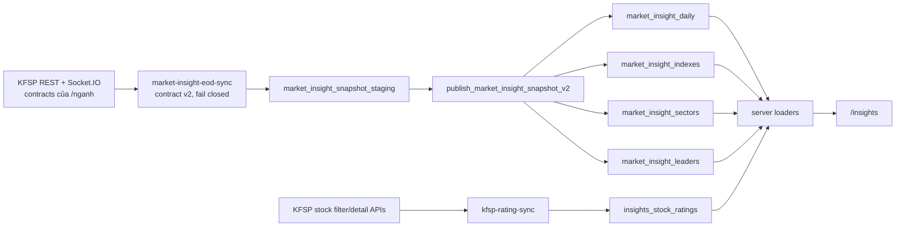

# Insights handover: KFSP source contract and operations

Tài liệu này là source of truth cho `/insights`. Bản audit ngày 2026-08-31 bắt đầu từ commit `bf5054d` và đối chiếu trực tiếp với trang **Kungfu Stocks Pro - Ngành** cùng JavaScript bundle đang chạy của KFSP.

## 1. Nguyên tắc bắt buộc

- Dữ liệu thị trường, ngành và định giá hiển thị trên Insights phải đến từ KFSP và có `as_of`/`session_date` rõ ràng.
- Không có preview rows, số mẫu, lịch sử tạo bằng công thức, ngày hard-code hoặc fallback từ một metric khác.
- Trường KFSP thiếu phải giữ `null` và UI hiển thị `—`/empty state.
- Không tự suy ra RRG, MA, P/E, P/B, độ lệch chuẩn, Nỗ lực hoặc Kết quả.
- Giá trị QeoIndex tự tính phải có tên **Qeo**, công thức và owner rõ ràng; không được gắn nhãn như điểm KFSP.
- Provider drift hoặc thiếu P0 làm run `failing`; snapshot cũ đang tốt không bị thay bằng snapshot thiếu dữ liệu.

## 2. Luồng dữ liệu



`market-insight-eod-sync` tự lấy bốn chỉ số từ KFSP `getliveindex`; unified EOD workflow không gửi TradingView `canonicalIndexes` vào collector nữa.

## 3. Contract KFSP đã verify

### 3.1. Market health và index

| KFSP call | Payload dùng | Cách lưu/hiển thị |
| --- | --- | --- |
| `getmarketpulsemabyindex("VNINDEX")` | `name[]`, `above[]`, `under[]` | `% trên MA = above / (above + under) * 100` cho MA10/20/50/200. Đây là phép đổi shape trực tiếp. |
| `getdatariskindex("VNINDEX", 200)` | `{ risk, tradingdate }[]` | Giữ nguyên thang `0..1`; không nhân 100 khi lưu. UI có thể format thành tỷ lệ nhưng tooltip giữ giá trị gốc. |
| `getpsychologyindicator("VNINDEX", 200)` | `{ value, tradingdate }[]` | Giữ nguyên thang `0..100`. Nhãn: `<20` Sợ hãi tột độ, `20–39` Sợ hãi, `40–59` Trung lập, `60–79` Tham lam, `>=80` Tham lam tột độ. |
| `getvaluationindex("VNINDEX", 200)` | `price`, `pe`, `pb`, các field `pe_*std_*`, `pb_*std_*` | Vẽ trực tiếp P/E, P/B và dải 1SD/2SD của provider. Không tạo SD từ history giá và không suy P/B từ P/E. |
| `getliveindex(["VNINDEX","VN30","HNXINDEX","UPCOMINDEX"])` | `stockcode`, `lastprice`, `change`, `perchange`, `advances`, `declines`, `nochange`, `totalvol`, `totalvalue`, `time` | Map mã `HNXINDEX → HNX`, `UPCOMINDEX → UPCOM`; các giá trị khác giữ nguyên đơn vị provider. |

REST KFSP `market_pulse/getContent` cung cấp `distribution_count`; không gắn thêm cửa sổ “25 phiên” vì response không công bố window. REST cash-flow cung cấp khối ngoại/tự doanh theo đúng field provider.

### 3.2. Ngành

| KFSP call | Ý nghĩa chính xác |
| --- | --- |
| `getdataibdnganh()` | `ten_nganh`, `closeprice`, `rss`, `totalval_market_pulse`, `totalvalbefore_market_pulse`, `percent_market_pulse`, `percent_market_pulse_marketcap`. |
| `percent_market_pulse` | **Nỗ lực**: % thay đổi giá trị giao dịch hiện tại so với phiên trước. Có thể lớn hơn 100%; minimum hợp lệ là `-100%`. |
| `percent_market_pulse_marketcap` | **Kết quả**: % thay đổi giá ngành. Đồng thời là `average_change_pct` trong read model. |
| `getincreasesdecreasesnganh(names)` | Số mã tăng/giảm/đứng giá từng ngành. Coverage chỉ đạt khi match đủ mọi ngành của snapshot. |
| `getdatarrgnganh(names, "VNINDEX", 9)` | Lịch sử ngày + status provider: `Dẫn dắt`, `Phục hồi`, `Suy yếu`, `Đội sổ`. Response 9 phiên dùng trên `/nganh` đang theo thứ tự cũ → mới; current state là phần tử cuối. |
| `getdatama(slugs)` | `ma10`, `ma20`, `ma50` có giá trị `up`/`down`. Slug phải khớp hàm của KFSP, gồm special case `NÔNG - LÂM - NGƯ → nong_lam_ngu` và giữ punctuation khác. |

UI không còn:

- tự xếp RRG từ biến động/độ rộng;
- suy MA từ RS hoặc momentum;
- tính ngược GTGD phiên trước từ Nỗ lực;
- dùng ngày, sparkline, VNINDEX, GTGD hoặc ticker pill hard-code;
- tạo P/E/P/B/risk history giả.

### 3.3. Stock ratings

- Chỉ đọc snapshot `source = 'kfsp'` và `is_published = true` từ `public.insights_stock_ratings`.
- 4M, CANSLIM, RS-S, RS-M, RRG, giá, volume, valuation và các `kfsp_metrics` giữ nguyên provider value sau normalize đơn vị đã document.
- Component thiếu giữ `null`; không lấy composite để lấp 4M/CANSLIM/RS.
- `kfsp_price_potential` chỉ nhận label string provider. Không tự tạo label từ fair value/price.
- Cột DB `kfsp_composite_score` là legacy name. Giá trị là **Qeo composite**:

```text
mean(các giá trị có mặt trong [KFSP 4M, KFSP CANSLIM, KFSP stock RS-S, KFSP sector RS-S])
```

Null bị loại khỏi mean; nếu cả bốn null thì composite null. UI phải ghi “Qeo composite” hoặc “Nguồn KFSP · điểm Qeo”, không gọi đây là model/composite của KFSP.

`QeoIndex state radar` là heuristic UI riêng, owner tại `lib/insights-rating-model.ts`; công thức/weights nằm trong file và UI ghi rõ đây không phải logic proprietary của KFSP. Nếu thay đổi công thức phải cập nhật tests và metric guide trong cùng commit.

## 4. Storage contract v2

Migrations:

- `supabase/migrations/20260830113000_kfsp_insights_exact_contract_v2.sql`: schema/constraints và RPC v2.
- `supabase/migrations/20260831002500_fix_kfsp_insights_v2_staging_capture.sql`: giữ payload v2 trong biến transaction trước khi publisher v1 cleanup staging; nếu bỏ guard này, history/MA/RRG sẽ không được persist.

### `market_insight_daily`

- Direct fields: `sentiment_score`, `risk_score`, `distribution_count`, MA breadth, cash flows, totals.
- History JSON: `sentiment_history`, `risk_history`, `valuation_history`.
- `risk_score` constraint: `0..1`.
- `market_regime` và `distribution_window` nullable; collector v2 không tự tính hai field này.

### `market_insight_sectors`

- Direct fields: `close_price`, `traded_value`, `previous_traded_value`, `average_change_pct`, breadth, `rs_score`, `rotation_state`, `effort_pct`, `result_pct`, `ma10_state`, `ma20_state`, `ma50_state`, `rotation_history`.
- `strength_ratio`, `momentum_ratio`, `effort_result_state` giữ nullable và không được local normalizer dựng lên.

### Atomic publish

`publish_market_insight_snapshot_v2(uuid)` gọi publisher v1 để giữ lock/P0 validation/four-table replace, sau đó ghi các cột v2 trong cùng transaction. Chỉ `service_role` được execute.

## 5. Scheduler và deployment

| Job | Lịch UTC | Lịch ICT | Vai trò |
| --- | --- | --- | --- |
| `kfsp-rating-daily-7am-ict` | `0 0 * * *` | 07:00 hàng ngày | Stock rating snapshot. |
| `qeoindex-eod-pipeline-1515-ict` | `15 8 * * 1-5` | 15:15 thứ Hai–thứ Sáu | Unified EOD; phase `MARKET_CLOSE_COLLECT` gọi `market-insight-eod-sync`. |

Khi thay đổi resource Supabase:

```bash
npx supabase db push
npx supabase functions deploy market-insight-eod-sync --no-verify-jwt
npx supabase functions deploy kfsp-rating-sync --no-verify-jwt # chỉ khi function rating thay đổi
```

Không log token, credential hoặc URL có query token. Token KFSP chỉ nằm trong Edge Function secret/cache được bảo vệ.

Trạng thái production ngày 2026-08-31: contract v2 và hai function trên đã deploy. Các snapshot 2026-08-26 đến 2026-08-28 vẫn mang `contract_version = 1`; migration sửa thang risk và đưa các trường từng bị map/suy diễn sai về null, không giả lập history/provider fields mới. Chúng sẽ được thay bằng snapshot v2 ở lần unified EOD thành công tiếp theo. Backfill lịch sử là thao tác replace dữ liệu production và chỉ chạy khi có phê duyệt riêng.

## 6. Verification runbook

### Local gates

```bash
pnpm typecheck
node --test tests/market-insight-validation.test.ts tests/market-insight-edge-types.test.ts
pnpm test:core
pnpm lint:touched
pnpm scan:secrets
pnpm build
```

Material UI change phải kiểm tra bằng browser thật: desktop + mobile, ba view `Nhịp đập TT` / `Nỗ lực - Kết quả` / `Sức khỏe TT`, empty state, tooltip, modal stock, không console error.

Bubble universe: the post-session `Bubbles · Bản đồ giao dịch thị trường` reads a separate latest-published KFSP query, not the composite-ranked detail result. It keeps rows with `average_volume_50_sessions > 300000`, orders descending by that provider-owned `avg50` field with ticker ascending as the tie-break, and limits the result to 200. KFSP defines `avg50` as average trading volume over 50 sessions, but this repository does not establish whether the provider unit is shares or lots; copy must keep that unit unqualified. Missing values are excluded and a smaller result is displayed honestly.

Kết quả acceptance ngày 2026-08-31 trên Chrome đã xác thực với local production build `localhost:3001`: ở mobile 390x844, cả trạng thái đóng và mở đều có `clientWidth/scrollWidth = 390/390`; dropdown nằm trong rect `16..374` (rộng 358px) và hiển thị đủ 4 links. Empty state thiếu Kết quả KFSP hiển thị trung thực; chọn `1W` + `Columns` cho Top 100, document width vẫn 390; console có 0 errors/0 warnings (chỉ log dự kiến của Vercel Analytics/Speed Insights trên localhost). Sau khi reset viewport về desktop 2294px, dropdown có rect `453..843` (rộng 390px), không có document overflow. Đây là acceptance lịch sử của local production build, chưa phải verification trên Vercel production đã deploy.

Top 200 bubble QA trên browser thật chưa được thực hiện; cần acceptance mới trên desktop/mobile trước release.

### Production SQL

```sql
select session_date, risk_score, sentiment_score,
       jsonb_array_length(risk_history) as risk_points,
       jsonb_array_length(sentiment_history) as sentiment_points,
       jsonb_array_length(valuation_history) as valuation_points,
       market_regime, distribution_window, quality_status
from public.market_insight_daily
order by session_date desc
limit 5;

select session_date, count(*) as sectors,
       count(*) filter (where rs_score is not null) as with_rs,
       count(*) filter (where rotation_state <> 'unknown') as with_rrg,
       count(*) filter (where effort_pct is not null and result_pct is not null) as with_effort_result,
       count(*) filter (where ma10_state is not null and ma20_state is not null and ma50_state is not null) as with_ma
from public.market_insight_sectors
group by session_date
order by session_date desc
limit 5;

select as_of_date, count(*) as rows,
       count(*) filter (where kfsp_score_4m is not null) as with_4m,
       count(*) filter (where kfsp_canslim_score is not null) as with_canslim,
       count(*) filter (where kfsp_composite_score is not null) as with_qeo_composite
from public.insights_stock_ratings
where source = 'kfsp' and is_published
group by as_of_date
order by as_of_date desc
limit 5;
```

Đối chiếu ít nhất một snapshot với DOM KFSP `/nganh`: risk giữ thang `0..1`, sentiment/MA breadth khớp, số ngành khớp, và với một ngành phải khớp đồng thời `Giá`, `RS`, `Nỗ lực`, `Kết quả`, RRG, MA10/20/50.

## 7. Release boundary

- Supabase migration/function deploy áp dụng ngay theo project invariant.
- Next.js UI chỉ lên production qua Git Integration: merge/push `main` → đúng một Vercel deployment.
- Không chạy `vercel --prod` và không redeploy chỉ để verify.

## 8. Market-health UI contract (2026-08-31)

- `Nhịp đập thị trường & Sức khoẻ thị trường` composes a 70/30 overview/sentiment row and a responsive risk/valuation row; the old breadth/MA summary column is not rendered.
- The four Market internals charts and two 20-session charts are mounted once in this composition. Their existing bounded chart dimensions, real-data inputs, and empty states remain authoritative.
- Sentiment has no provider-segment selector; the displayed value is the published KFSP market sentiment only.
- VNINDEX liquidity displays the raw provider value with at most two decimals and explicitly labels the provider unit as unverified. No ingestion conversion is implied until the provider contract proves `totalvalue` units.

## 9. Market AI conclusion runtime

- `market-ai-conclusion` is a machine-authenticated Supabase Edge Function. It reads only the same published `market_insight_daily`, `market_insight_indexes`, `market_insight_sectors`, and `market_insight_leaders` snapshot for `latest` or an explicit `session` date.
- Evidence is point-in-time and hashed with `market-ai-conclusion-v2`; the packet is facts-only (`observations=[]`), and its identity includes the completed sync-run id, payload checksum, contract version, session/asOf and source. Mixed `as_of` rows, missing provenance, incomplete mandatory dimensions, or non-healthy snapshot quality complete as `insufficient_evidence` without an LLM call. Claims are validated against exact dimension-owned fact refs, risk indexes, missing-evidence set, and citations.
- A successful call is one structured OpenAI Responses request using the explicitly configured and API-validated `MARKET_AI_MODEL`, medium reasoning and at most 1,800 output tokens. The prompt treats CANSLIM/4M as an explanatory lens only: no invented score/formula or investment advice. Claim/lease/cost/error telemetry is persisted in `market_ai_conclusions`; a model-start marker quarantines expired work as `completion_unknown` so it cannot auto-spend again.
- The function accepts only `x-market-ai-secret` backed by dedicated `MARKET_AI_CONCLUSION_SECRET`. EOD does not dispatch AI automatically. A service-role-only pg_net RPC is available for an explicitly approved/manual invocation and remains unscheduled.
# Market AI runtime note

- Market-level CANSLIM/4M-inspired conclusions use `gpt-5.6-terra` with `reasoning=low`, structured output, immutable evidence provenance, and a hard `$0.03` per-attempt cost gate. The lower reasoning tier is intentional: the model explains precomputed evidence and does not calculate indicators or override deterministic policy.
